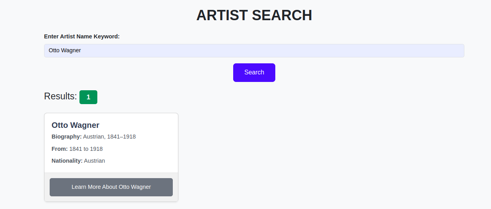
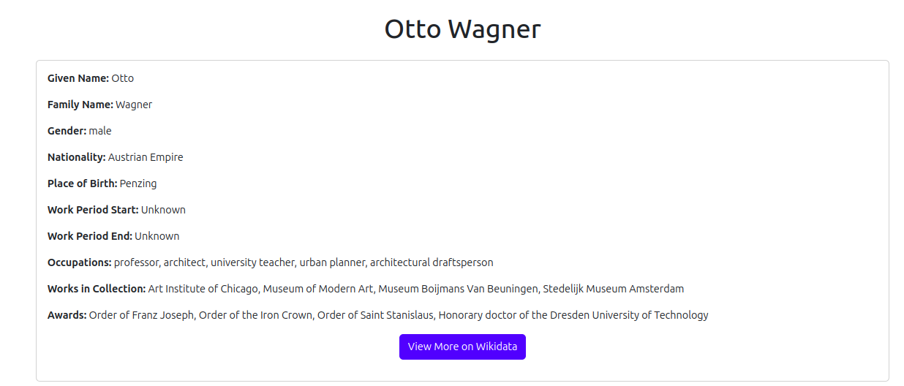
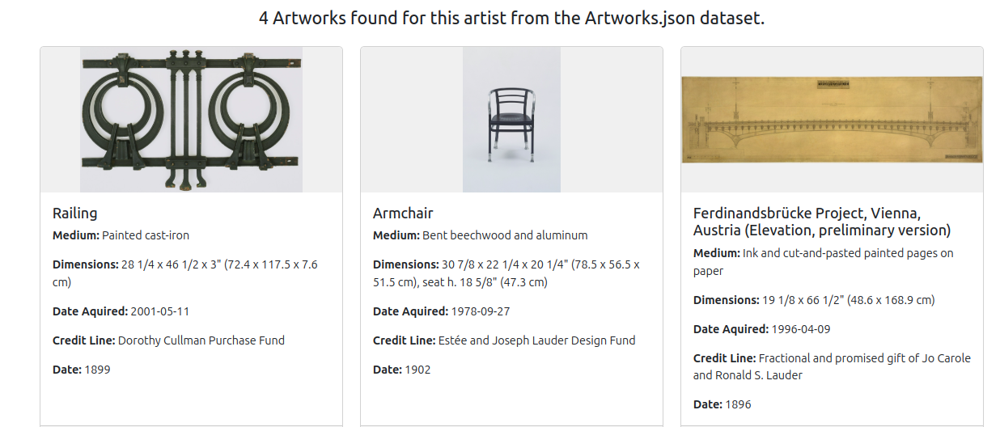
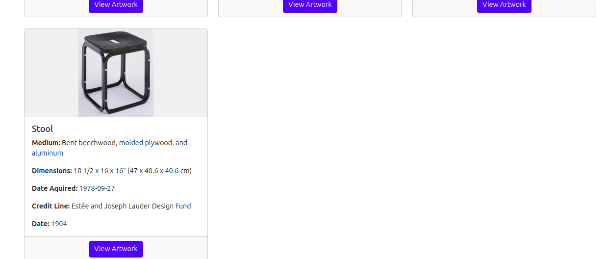

#  SPARQL Anything Artist Explorer

## Overview
The **SPARQL Anything Artist Explorer** is a dynamic platform that allows users to search for artists, access detailed information about them, and explore their artworks. This project harnesses the power of **SPARQL Anything**, a versatile tool that allows **SPARQL** queries over heterogeneous data sources like JSON, CSV, XML, and more. By using **SPARQL Anything**, the application seamlessly integrates data from local JSON files and external semantic data from Wikidata, delivering a comprehensive and enriched user experience.

### **Datasets Used**
This project utilizes three datasets:
- **Non-Knowledge Graph (Non-KG) Datasets:**
  - **[Artists.json](https://github.com/MuseumofModernArt/collection/blob/main/Artists.json):** Contains structured information about various artists.
  - **[Artworks.json](https://github.com/MuseumofModernArt/collection/blob/main/Artworks.json):** Contains detailed information about artworks associated with the artists.

- **Knowledge Graph (KG) Dataset:**
  - **[Wikidata](https://www.wikidata.org/):** A large, collaborative knowledge base that provides enriched and interconnected data about artists.

## Features
- **Artist Search:** Search artists using the local `artists.json` file via SPARQL queries powered by **SPARQL Anything**.
- **Detailed Artist Information:** Fetch real-time artist details from Wikidata using SPARQL queries when a Wikidata QID is available.
- **Artwork Exploration:** View related artworks sourced from the `artworks.json` file using SPARQL Anything.
- **User-Friendly Interface:** Navigate through a clean and responsive UI to explore artist information seamlessly.

## Application Flow
1. **Search for Artists:** Enter an artist's name into the search bar.
2. **Local SPARQL Query:** The app sends a SPARQL query to the **SPARQL Anything** server to search the `artists.json` file.
3. **Explore More:** Click the **"Learn More About <artist name>"** button to fetch additional details from Wikidata and related artworks from `artworks.json` via SPARQL Anything.
4. **Detailed View:** Detailed artist information and associated artworks are displayed with an option to view even more on Wikidata.

## Installation
1. **Clone the repository:**
   ```bash
   git clone https://github.com/eleccrazy/KG_project_with_sparql_anything.git
   cd KG_project_with_sparql_anything

## 2. Install Dependencies

```bash
pip install -r requirements.txt
```

## 3. Configure the `.env` File

Create a `.env` file in the root directory and add the following:

```ini
SPARQL_ENDPOINT=http://localhost:<your-port>/sparql.anything
ARTISTS_JSON_PATH=path/to/Artists.json
ARTWORKS_JSON_PATH=path/to/Artworks.json
```

> **Note:** Replace `<your-port>` with your desired port number.

## 4. Download and Run the SPARQL Anything Server

- **Download:** Get the latest version from [SPARQL Anything Releases](https://github.com/SPARQL-Anything/sparql.anything/releases)

- **Run the server:**
  ```bash
  java -jar sparql-anything-*.jar server -p <your-port>
  ```

  **Note:** Replace `<your-port>` with the port specified in your `.env` file.

## 5. Run the Application

```bash
python3 -m app.app
```

## 6. Access the Application

Open your browser and visit:

```
http://127.0.0.1:5000
```

## Data Fetching Process

- **Artist Search:**
  - When a user searches for an artist, the `query.py` script sends a SPARQL query to the **SPARQL Anything** server.
  - The server queries the `artists.json` file to find matching artist data.

- **Artwork Retrieval:**
  - Upon clicking the **"Learn More About <artist name>"** button, the application sends another SPARQL query to fetch related artworks from the `artworks.json` file.

- **Extended Information:**
  - If a Wikidata QID is found, additional information about the artist is fetched from Wikidata using the `wiki_data_query.py` script.


## 📸 Screenshots

### 1. Artist Search Page


### 2. Artist Details Page


### 3. Artwork Display



## Data Sources

- [DBpedia](https://dbpedia.org/page/DBpedia) for linked data concepts.
- [MoMA Artists Dataset](https://github.com/MuseumofModernArt/collection/blob/main/Artists.json)
- [MoMA Artworks Dataset](https://github.com/MuseumofModernArt/collection/blob/main/Artworks.json)

## Technologies Used

- **Python**: Backend logic and server handling  
- **Flask**: Web framework for routing and handling requests  
- **SPARQL Anything**: For querying JSON data using SPARQL 
- **Wikidata SPARQL Endpoint**: For fetching external artist data  
- **HTML/CSS/Bootstrap**: Frontend design and styling  
- **python-dotenv**: Loading environment variables from `.env`  

## Contributing

Contributions are welcome! Please follow these steps:
1. Fork the repository  
2. Create a new branch (`git checkout -b feature-branch`)  
3. Commit your changes (`git commit -m 'Add new feature'`)  
4. Push to the branch (`git push origin feature-branch`)  
5. Open a Pull Request  

## License

This project is licensed under the MIT License.

## Acknowledgments

- [Wikidata](https://www.wikidata.org/) for providing rich and structured data.  
- [SPARQL Anything](https://sparql-anything.cc/) for enabling SPARQL queries over JSON data.  
- [Museum of Modern Art](https://github.com/MuseumofModernArt/collection) for their public datasets.  

---
